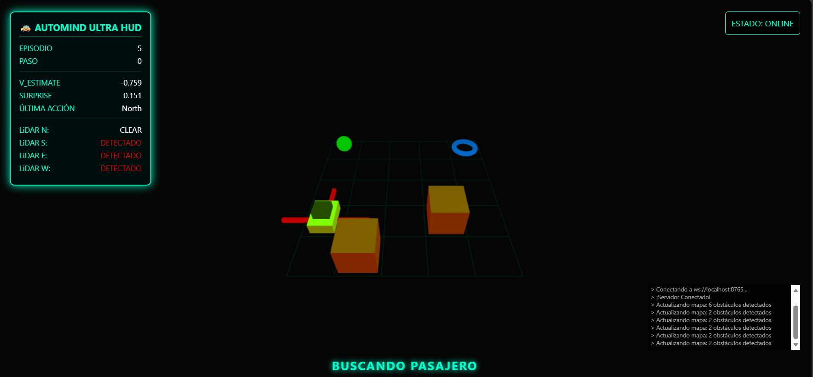

# AutoMind-Agent: Autonomous Navigation through Nested DRL

Un sistema de navegación autónoma desarrollado mediante **Deep Reinforcement Learning (Nested PPO-LSTM)** con arquitectura cognitiva avanzada.

> 🎥 **[Ver Demostración en YouTube](https://www.youtube.com/watch?v=y8B7s-VUskQ)**

---

## 💡 Introducción

### La Problemática
La problemática ha estado siempre presente en el campo de la Inteligencia Artificial: **la ineficiencia del aprendizaje**. Los agentes actuales aprenden lento, requieren recursos computacionales inmensos (clusters de GPUs) y sufren de amnesia digital (Olvido Catastrófico) al enfrentar nuevas tareas.

### La Solución: Hombros de Gigantes
Nuestra respuesta no es reinventar la rueda. **AutoMind-Agent** se apoya en la investigación de vanguardia de **Google DeepMind** (arquitecturas de memoria profunda) y la aplica con una capa de innovación diseñada para la accesibilidad.
Hemos creado una solución que no solo replica, sino que **adapta** estos avances para funcionar eficientemente en hardware de consumo, ya sea utilizando **CPU, GPU o un enfoque híbrido**. No buscamos solo un agente que navegue; buscamos democratizar el acceso a arquitecturas cognitivas robustas.

---

## 📊 Resultados Empíricos (Entrenamiento Real)

Los siguientes datos fueron obtenidos en una ejecución real (Single-Run) utilizando un procesador **Intel i9-10900KF (CPU-Only)**, demostrando la eficiencia del código sin necesidad de aceleración por hardware dedicado.

### Resumen de Convergencia
El agente logró **maestría total (curriculum completo)** en tan solo **06 minutos y 49 segundos**, reduciendo el tiempo de entrenamiento en más de un 60% respecto a versiones anteriores y manteniendo una alta precisión en todos los niveles.

| Nivel | Dificultad | Tasa de Éxito Final | Estado |
|:---:|:---|:---:|:---|
| **L0** | Infante (Sin obstáculos) | **99%** | ✅ Completado |
| **L1** | Explorador (Spawn aleatorio) | **92%** | ✅ Completado |
| **L2** | Aprendiz (Obstáculos bajos) | **91%** | ✅ Completado |
| **L3** | Experto (Alta densidad) | **90%** | ✅ Completado |

### Análisis de la Fase "Experto" (L3)
En esta última fase, el agente demostró su robustez al navegar en entornos de alta densidad de obstáculos con un **90% de éxito**. La arquitectura cognitiva permitió una convergencia asombrosa, optimizando la tasa de aprendizaje (`LR: 1.6e-04`) para estabilizar el comportamiento final.

---

## 🧠 Arquitectura del Agente

### Slow-Fast Networks (Olvido Catastrófico)
El sistema implementa redes duales para combatir el **Olvido Catastrófico** (*Catastrophic Forgetting*):
- **Fast Network:** Se adapta dinámicamente a la exploración inmediata.
- **Slow Network (Target):** Destila y consolida conocimiento global mediante **Polyak Updates** (`tau=0.01`).

### Aprendizaje Curricular: Curriculum Gate
El agente aprende de forma progresiva, atravesando "Gates" de dificultad:

1.  **Nivel 0 (Infante):** Navegación básica.
2.  **Nivel 1 (Explorador):** Generalización de spawns.
3.  **Nivel 2 (Aprendiz):** Introducción de obstáculos.
4.  **Nivel 3 (Experto):** Navegación compleja con alta densidad.

### Motivación Intrínseca (Curiosidad)
El agente utiliza **TD-Error Surprise** como señal de curiosidad intrínseca, priorizando situaciones novedosas para un aprendizaje significativamente más rápido.

---

## 📁 Estructura del Proyecto

```
AutoMind-Agent/
├── scripts/                     # Código Python del agente
│   ├── taxi_env.py              # 🎮 Entorno Gymnasium personalizado
│   ├── train_gate.py            # 🧠 Script de entrenamiento (Curriculum Gate)
│   ├── demo_agent.py            # 🚀 Demo + bridge WebSocket → Unreal Engine
│   ├── manual_driver.py         # 🕹️ Control manual para testing
│   └── test_3d_client.py        # 🔌 Cliente de prueba WebSocket
│
├── models/                      # Modelo entrenado
│   └── automind_final.pth       # ✅ Checkpoint final (Nivel 3 completado)
│
├── visualizer/                  # Visualizador web ligero
│   ├── visualizer.html          # 🌐 Visualización HTML/JS
│   └── visualizer-html.png      # 📸 Screenshot del visualizador
│
├── unreal/                      # Proyecto Unreal Engine 5.6
│   ├── TaxiAgentSim.uproject
│   ├── Config/                  # Configuraciones del motor
│   ├── Source/                  # Código C++ del plugin
│   │   └── TaxiAgentSim/       # Actor, GameInstance, Types
│   └── Content/                 # Mapas y Blueprints
│
├── requirements.txt             # Dependencias Python
├── .gitignore
└── README.md
```

---

## 🚀 Quick Start

### Requisitos Previos
- **Python 3.10.x - 3.13.x** (Confirmado funcionamiento en la versión 3.13.12)
- **Git** (Para clonar el repositorio)
- **Unreal Engine 5.6** (Para la simulación 3D opcional)
- **Visual Studio 2022** con la carga de trabajo "Game development with C++"

### 1. Configurar el Entorno Python (Desde el Directorio Raíz)

> [!IMPORTANT]
> **Directorio de Trabajo:** Asegúrate de ejecutar todos los comandos desde la carpeta raíz del proyecto (`AutoMind-Agent/`).

```powershell
# 1. Clonar el repositorio
git clone https://github.com/rafael1599/AutoMind-Agent.git
cd AutoMind-Agent

# 2. Crear el entorno virtual
python -m venv .venv

# 3. Activar el entorno (Windows)
.venv\Scripts\activate

# 4. INSTALAR DEPENDENCIAS
# Asegúrate de estar en la raíz donde se encuentra 'requirements.txt'
pip install -r requirements.txt

# 5. Ejecutar la demo o el entrenamiento
python scripts/demo_agent.py
```

> [!TIP]
> **¿Error "No such file or directory: 'requirements.txt'"?**
> Este error ocurre si intentas instalar los requerimientos desde dentro de la carpeta `scripts/`. Vuelve a la raíz del proyecto (`cd ..`) y repite el comando `pip install -r requirements.txt`.

> [!CAUTION] 
> **Gestión de Recursos (CPU):** 
> El entrenamiento es una tarea intensiva. Por defecto, el script usa **12 procesos paralelos** (`NUM_ENVS = 12`).
> Si notas que tu PC se calienta excesivamente o se vuelve lenta, puedes editar `scripts/train_gate.py` y reducir `NUM_ENVS` a un número menor (ej. 2 o 4). El código funcionará en cualquier CPU, pero la velocidad de aprendizaje disminuirá.

### 2. Entrenar tu Propio Agente (Opcional)

El modelo pre-entrenado (`models/automind_final.pth`) ya está incluido. Si deseas entrenar desde cero:

```bash
# Crear carpeta de modelos (si no existe)
mkdir models

# Iniciar entrenamiento con Curriculum Gate
python scripts/train_gate.py
```

El entrenamiento progresará automáticamente por los 4 niveles. Puedes monitorear el progreso con TensorBoard:

```bash
tensorboard --logdir data/logs
```

> 💡 **Compatibilidad:** El entrenamiento funciona en **CPU** (Intel i9 recomendado), **GPU** (CUDA), o modo **híbrido**. El script detecta automáticamente la mejor opción disponible.

### 3. Ejecutar la Demo con el Visualizador Web

Para una prueba rápida sin necesidad de Unreal Engine:

```bash
python scripts/demo_agent.py
```

Luego abre `visualizer/visualizer.html` en tu navegador para ver al agente en acción.



---

## 🎮 Configurar la Simulación en Unreal Engine 5.6

Sigue estos pasos para compilar y ejecutar la simulación 3D completa.

### Paso 1: Preparar el proyecto

> ⚠️ **Nota sobre los Assets:** Para mantener el repositorio ligero, se ha excluido la carpeta `CitySampleVehicles` (~7.5GB). Si deseas ver los modelos de autos en alta calidad, debes descargar el asset pack gratuito **City Sample Vehicles** en el Marketplace de Unreal Engine y colocarlo en `unreal/Content/CitySampleVehicles`. De lo contrario, el agente funcionará correctamente pero podría no mostrar el modelo 3D del vehículo.

1. Navega a la carpeta `unreal/` dentro del repositorio clonado.
2. **Clic derecho** sobre `TaxiAgentSim.uproject`.
3. Selecciona **"Generate Visual Studio project files"** en el menú contextual.
   - Esto creará el archivo `TaxiAgentSim.sln` y las carpetas `Intermediate/` necesarias.
   - ⚠️ Si no ves esta opción, asegúrate de tener **Unreal Engine 5.6** instalado correctamente.

### Paso 2: Compilar el proyecto

4. Abre el archivo `TaxiAgentSim.sln` que se acaba de generar con **Visual Studio 2022**.
5. En Visual Studio:
   - Asegúrate de que la configuración sea **Development Editor** y la plataforma **Win64**.
   - En el **Solution Explorer**, haz clic derecho sobre el proyecto `TaxiAgentSim` y selecciona **"Set as StartUp Project"**.
   - Presiona **Ctrl+B** (o menú **Build → Build Solution**) para compilar.
   - Espera a que la compilación termine exitosamente (puede tomar varios minutos la primera vez).

### Paso 3: Ejecutar la simulación

6. Presiona **F5** (o **Debug → Start Debugging**) para abrir el proyecto en el **Unreal Editor**.
7. Dentro del Unreal Editor, presiona **Play** (▶) para iniciar la simulación.
8. En una terminal separada, ejecuta el script de demostración para conectar el agente vía WebSocket:

```bash
python scripts/demo_agent.py
```

> El agente se conectará automáticamente al Unreal Engine y verás la navegación en tiempo real con efectos visuales de celebración al completar cada nivel.

---

## 🔬 Filosofía de Investigación

Este proyecto se erige sobre los **hombros de gigantes**. Utilizamos **Google DeepMind** como brújula arquitectónica y **NotebookLM** como catalizador crítico para orquestar flujos de conocimiento científico. No solo programamos un agente autónomo; participamos en una tradición de excelencia que busca democratizar el acceso a arquitecturas de memoria profunda complejas.

### Especificaciones Técnicas

| Dimensión | Hardware (i9-10900KF) | Modelo (Nested PPO-LSTM) | Throughput |
|:---|:---|:---|:---|
| **Paralelismo** | 10C / 20T | 12 Instancias Paralelas | ~6,500 steps/seg |
| **Ciclos de Reloj** | 3.70-5.30 GHz | Inferencia de Baja Latencia | Fast Network sin cuello de botella |
| **Memoria** | Ancho de banda masivo | Estructura Dual (Fast-Slow) | Destilación persistente |
| **Optimización** | Multi-threaded | Surprise-based Prioritization | Filtrado en segundo plano |

### Un Llamado a la Acción
A mis compañeros estudiantes y futuros ingenieros: el tiempo de ser meros consumidores de herramientas de IA ha terminado. Los instamos a dar el salto hacia la **arquitectura de sistemas inteligentes**. Seamos los arquitectos, no solo los operadores.


Proyecto: AutoMind-Agent

Curso: Introducción a la Inteligencia Artificial

Equipo de trabajo	Especialidades

Rafael Lopez Cordova	- Ingeniero de Sistemas

Yoandra Gisela Alvarez Perez	- Ingeniería Industrial

Iván Carlo Petrlik Azabache - 	Ingeniero de Computación y Sistemas

Maria Teresita Maydana	- Abogada Universidad de Buenos Aires, Mg. Relaciones Internacionales, Esp. IA

